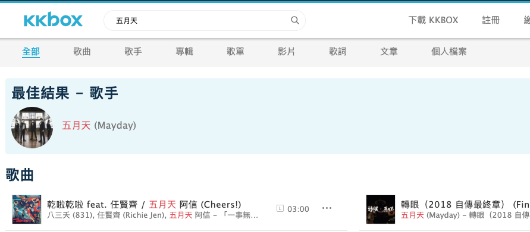
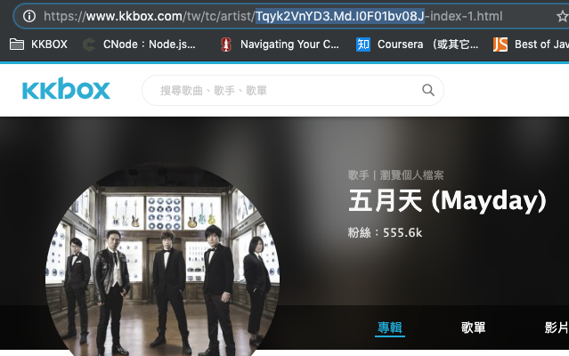
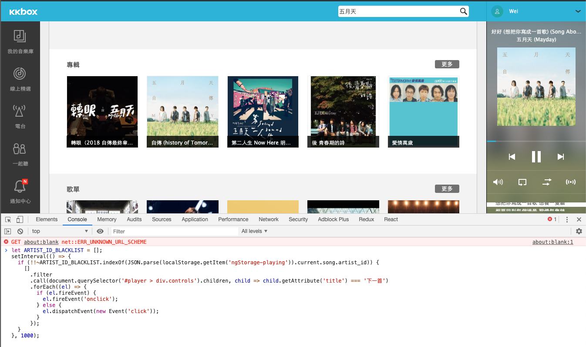
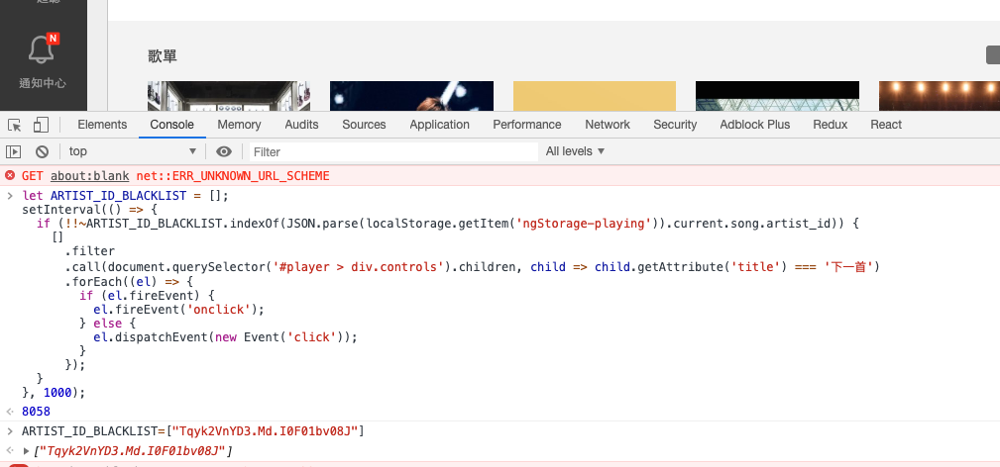

## KK Webplayer Blocker
---
KKBOX Web Player(https://play.kkbox.com/) 封鎖藝人歌曲的script.

播放KKBOX的播放清單或是電台時，跳過自己所封鎖藝人的歌曲。

### 使用方法

1. 在KKBOX搜尋介面中搜尋你想要封鎖的藝人 (https://www.kkbox.com/tw/tc/search.php)


2. 進入藝人頁面，複製網址內的藝人編號(圖中反白部分)


3. 前往 KKBOX Web Player (https://play.kkbox.com/) 按一下F12，然後在跳出的console介面中貼上這段程式碼，按下enter (如下圖)
```
let ARTIST_ID_BLACKLIST = [];
setInterval(() => {
  if (!!~ARTIST_ID_BLACKLIST.indexOf(JSON.parse(localStorage.getItem('ngStorage-playing')).current.song.artist_id)) {
    []
      .filter
      .call(document.querySelector('#player > div.controls').children, child => child.getAttribute('title') === '下一首')
      .forEach((el) => {
        if (el.fireEvent) {
          el.fireEvent('onclick');
        } else {
          el.dispatchEvent(new Event('click'));
        }
      });
  }
}, 1000);
```


4. 然後接著輸入`ARTIST_ID_BLACKLIST=["藝人編號"]`，若是有多個藝人可以這樣輸入`ARTIST_ID_BLACKLIST=["藝人編號A", "藝人編號B", "藝人編號C"]`


5. 完成，接下來遇到設定的藝人歌曲就會跳過不播了
